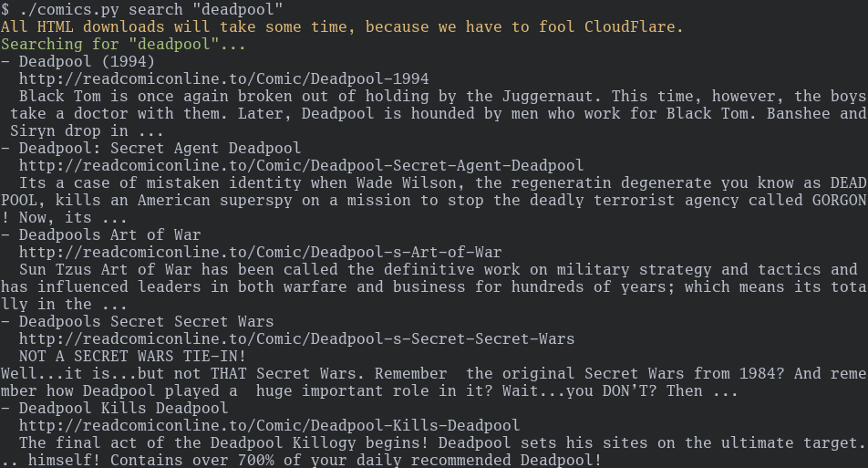
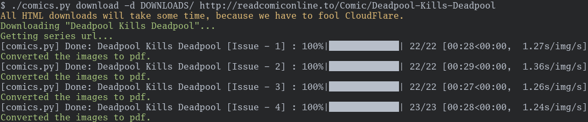

# comic-dl

`comic-dl` is a tool for downloading comics from _readcomiconline.li_.

You can search for comics and the download it. Alternatively you could browse
the website and download the chapters or series you're interested in.

_Search for a comic..._



_...and download it!_



The comics can be saved in `JPEG` and transformed to `PDF` files.

## Installation

1. Download the source from here: <https://git.sr.ht/~pglaum/comic-dl>
2. Install the `pikepdf` package for your platform (sometimes pip can't do
   this)
3. Install the package: `pip install .`

## Usage

```
Usage: comic-dl [OPTIONS] COMMAND [ARGS]...

  Initialize the CLI context.

Options:
  --debug / --no-debug
  --help                Show this message and exit.

Commands:
  download  Download a comicbook series or chapter.
  search    Search for a comicbook series.
```

You can either choose to search for a query or download a url.

### Search

```
Usage: comic-dl search [OPTIONS] KEYWORD

  Search for a comicbook series.

Options:
  -r, --results INTEGER  Maximum results [Default: 5]
  --help                 Show this message and exit.
```

For example usage see the image above.

### Download

```
Usage: comic-dl download [OPTIONS] URL

  Download a comicbook series or chapter.

  The URL can be a link to a chapter or series on readcomiconline.li. If URL
  leads to a series, all chapters will be downloaded.

Options:
  -d, --directory TEXT  The directory to download to
  --keep / --no-keep    Keep raw image files after converting to pdf [Default:
                        True]

  --pdf / --no-pdf      Convert images to pdf [Default: True]
  --help                Show this message and exit.
```

For example usage see the image above.

## Credits

Most of this is based of the code from here:
<https://github.com/Xonshiz/comic-dl>
